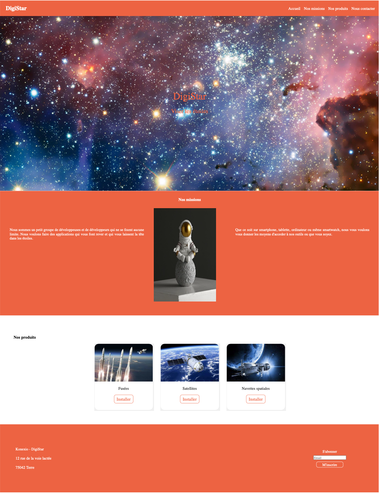
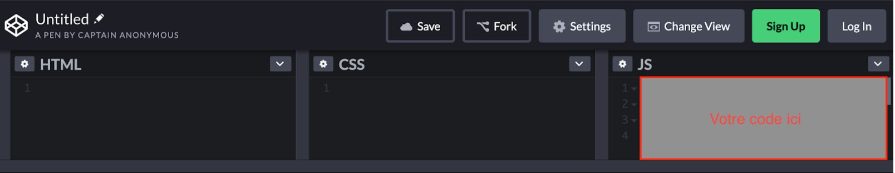
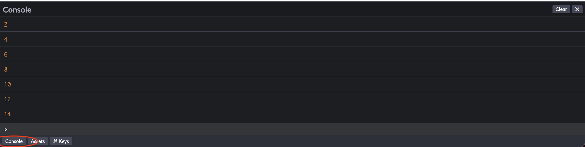

# Test technique d'entrée Konexio

### Prérequis\*\*

-   Un ordinateur
-   Un navigateur web à jour. Comme Google Chrome que vous pouvez télécharger ici : https://www.google.com/intl/en\_us/chrome/
-   Le logiciel Visual Studio Code (VSCode) installé. Logiciel open-source et gratuit que vous pouvez télécharger ici : https://code.visualstudio.com/

### Ce que l’on vous a fourni\*\*

On vous a fourni un fichier zip contenant :

-   Une image à reproduire en HTML et CSS (exemple.png)
-   Une image de ce qui est à reproduire en JavaScript (javascript.png)
-   Un dossier “img” avec 5 images (header.jpg, service1.jpg, service2.jpg, service3.jpg et dev.jpg)
-   Un dossier fonts avec les polices d’écritures utilisées dans la page d’exemple

Vous avez le droit d’ajouter d’autres ressources trouvées sur internet si cela peut faciliter votre travail.

Barème sur 35

    -HTML / CSS (25pts)
        -   Général (5pts)
        -   Barre de navigation (6pts)
        -   A propos (4pts)
        -   Services (6pts)
        -   Contact (4pts)
    -JavaScript (10pts)

    -Table de multiplication (10pts)

## HTML / CSS

Reproduire cette image en page HTML et CSS.

## JavaScript

Ecrire une boucle en JavaScript qui permettra d’afficher dans la console tous les nombres paires entre 0 et "nb".

Dans l’exemple ci-dessous, la variable “nb” est égale à 15.

Utiliser le site suivant : [https://codepen.io](https://codepen.io/)

Vous n’avez pas besoin de créer un compte, vous pouvez commencer à coder en cliquant sur le bouton “Start coding” en haut à gauche pour vous retrouver sur une page similaire que l’image ci-dessus.

Ensuite, cliquer sur le petit bouton en bas à gauche qui s’appelle “Console”. C’est ici que votre code JavaScript s’affichera.

_N.B : Vous pouvez utiliser d’autres sites ou d’autres moyens pour écrire votre code JavaScript, le principal est que vous nous envoyez votre code dans un fichier “table.txt” avec votre code HTML / CSS._

### Ce que vous devez nous fournir

**Avant la date qui vous a été donné dans l’email, merci de nous envoyer :**

Un dossier compressé en ZIP avec :

-   Un fichier HTML en racine qui lorsqu’on double-cliquera dessus ouvrira la page web qui reproduit l’image mais de manière interactive
-   Au moins un fichier CSS pour styliser votre page
-   Toutes les autres ressources utilisées pour que l’on puisse voir votre page finale
-   Un fichier “table.txt” (et pas .js puisqu’il ne passera pas dans les emails) avec le code JavaScript

**Donc n’hésitez pas, à vous même compresser et décompresser le fichier ZIP que vous testerez avant de nous l’envoyer (vérifier votre travail, ce serait dommage que vous soyez noté sur la moitié de ce que vous avez effectué)**

Bon code et nous attendons votre email :-)

### Annexe

Quelques sites pour vous aider :

-   **Google**. C’est par là que tout développeur commence sa recherche. N’hésitez pas à taper les questions les plus simples que vous avez. D’autres sont aussi passés par là et vous seriez surpris des résultats.
-   HTML / CSS : [https://openclassrooms.com/fr/courses/1603881-apprenez-a-creer-votre-site-web-av ec-html5-et-css3/1604361-votre-premiere-page-web-en-html](https://openclassrooms.com/fr/courses/1603881-apprenez-a-creer-votre-site-web-avec-html5-et-css3/1604361-votre-premiere-page-web-en-html)
-   HTML / CSS : Lire c’est bien, mais pratiquer c’est mieux. Pensez à copier-coller ces exemples pour voir comment ça marche sur votre ordinateur : [https://developer.mozilla.org/fr/docs/Apprendre/HTML/%C3%89crire_une_simple_pa ge_HTML](https://developer.mozilla.org/fr/docs/Apprendre/HTML/%C3%89crire_une_simple_page_HTML)
-   JavaScript : La partie 1, spécialement le chapitre 6 sera le chapitre qui vous donnera les clés pour réussir l’exercice <https://openclassrooms.com/fr/courses/2984401-apprenez-a-coder-avec-javascript>
-   CSS Flexbox : <https://la-cascade.io/flexbox-guide-complet/>

### Astuces

-   Cherchez des templates de “landing page” en ligne faits par d’autres personnes et faites un clic droit sur la page, puis cliquer sur “Afficher le code source”… Surprise !
